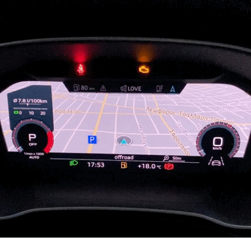
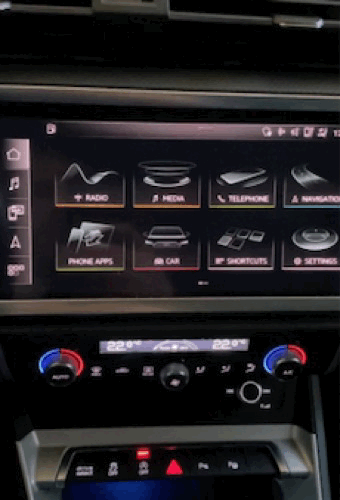
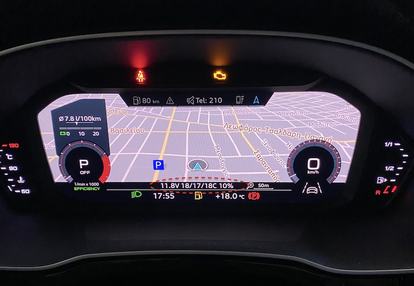
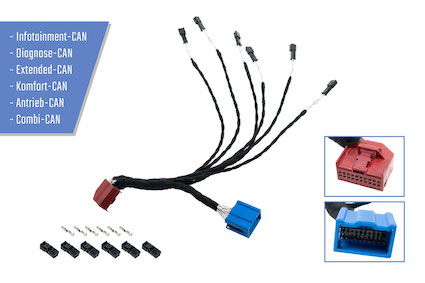
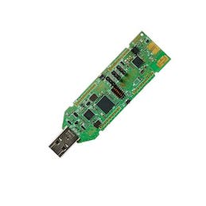
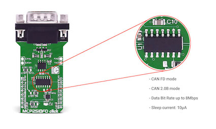

DISCLAIMER

THE MATERIAL AND INFORMATION SHARED IN THIS REPOSITORY IS FOR GENERAL INFORMATION AND EDUCATION PURPOSES ONLY. YOU SHOULD NOT RELY UPON THE MATERIAL OR INFORMATION ON THIS REPOSITORY AS A BASIS FOR MAKING ANY MODIFICATIONS, ADJUSTMENTS TO YOUR VEHICLE OR ALTER ANY OF ITS FUNCTIONALITY. WHILE THE INTENTION IS TO KEEP TE INFORMATION UP TO DATE AND CORRECT, IT IS PROVIDED "AS IS" WITHOUT WARRANTY OF ANY KIND EXPRESS OR IMPLIED ABOUT THE COMPLETENESS, ACCURACY, RELIABILITY, SUITABILITY WITH RESPECT TO THE INFORMATION, SOURCE CODE OR REFERENCES PROVIDED IN THIS REPOSITORY. ANY RELIANCE YOU PLACE ON SUCH MATERIAL IS THEREFORE STRICTLY AT YOUR OWN RISK. THE REPO MAINTAINER WILL NOT BE LIABLE FOR ANY FALSE, INACCURTE, INAPPROPIATE OR INCOMPLETE INFROMATION AND MATERIAL PRESENTED IN THIS REPOSITORY, OR ANY DAMAGES WHATSOEVER RESULTING FROM LOSS OF INCOME OR PROFITS, WHETHER IN AN ACTION OF CONTRACT, NEGLIGENCE OR OTHER TORTIOUS ACTION, ARISING IN CONNECTION WITH THE USE OR PERFORMACE OF THIS MATERIAL.

---

**CAN Gateway Sniffer**

A common issue of most vehicle "CAN hacking" solutions is that they rely on the diagnostic OBD port interface to retrieve information through the standard OBD-II PIDs or through the more advanced UDS protocol. In practice, only a very small fraction of the vehicle signals is exposed through the OBD-II PIDs, and although UDS is quite powerful, its full potential is only unlocked by the actual vehicle manufacturers.

The CAN Gateway Sniffer is able to monitor any signal from the internal CAN buses (a modern vehicle has typically more than 5), giving the user the possibility to reverse engineer its functionality (eg what signal corresponds to the wheel button press) and then perform some action by triggering a new CAN message (eg control start stop function, select driving mode). It is also possible to create CAN messages that update any of the virtual cockpit text fields. In this way, applications can be created that do not rely on a external LCD.

The device is capable of sniffing any CAN message of the internal bus (eg extended, convenience, drivetrain, diagnostic, infotainment)  which are connected to the CAN gateway device (typically named as J533). It can also react on them and trigger new CAN messages to alter any of the vehicle functionality. It is applicable to most recent VW/Audi/Skoda/Seat models.

The vehicle that was used to develop and test this application is an Audi Q3 F3 (2019). The application in this repository demonstrates the following:

1) The press of the steering wheel "asterisk" button, enables/disables the vehicle "Start/Stop" functionality
2) The simultaneous press of the steering wheel "asterisk" and "back" button, select the "Efficiency" drive select mode.
3) The "mirror adjustment select" knob, enables the car alarm "valet" mode
4) All the control and status messages of the application are displayed in the Virtual Cockpit of the car (no external display or other interface is needed)
5) Standard OBD-II PID are used at the diagnostic bus (eg coolant temperature, fuel level) and the returned values are displayed at the virtual cockpit. Since there is no dedicated OBD-II PID for the oil temperature, the corresponding measurement is taken by sniffing the proper PID in the convenience CAN bus.

| Start-Stop control using steering wheel button | Drive Select control using steering wheel button |
| :--------------------------------------------: | :----------------------------------------------: |
|                  |                  |

---

**HW Setup**

The target is to accomplish this with as few off-the-self components as possible, use the least invasive method to tap on the vehicle wiring and use a reliable low-power embedded MCU to sniff and send messages to the CAN buses. This is accomplished with only 3 components, no tools or custom PCBs are needed, including custom wires or soldering!

1. The adapter used to tap on any of the CAN bus is the one provided from Kufatec. It is a simple male-female extension cord that connects on the CAN gateway and exposes 6 twisted wire pairs, one for each CAN bus that gets into the gateway (extended, convenience, drivetrain, diagnostic, infotainment).

https://www.kufatec.com/en/accessories-spare-parts/cables/can-bus-gateway-adapter-plug-play-44479

2. The chosen MCU is the DA1469x from Renesas (former Dialog Semi) and especially the DA1469x USB DK. It contains an ARM-M33 running up to 96MHz, 512KB RAM, 2MB Flash as well as a BLE 5.2 compliant radio. It has a very small form factor that can easily fit next to the CAN Gateway, it is very low power, it can be powered by the vehicle USB port and has two Microbus slots which can fit two MCP2518FD to control up to two internal CAN bus at the same time.

https://gr.mouser.com/ProductDetail/Dialog-Semiconductor/DA14695-00HQDEVKT-U?qs=sGAEpiMZZMuqBwn8WqcFUj2aNd7i9W7uLeT7ecJEyQiKZqyOLvNA6Q%3D%3D

3. The MCP2518FD is a complete CAN solution, which can be used as a control node in a CAN network. It connects directly to the vehicle CAN bus wires and exposes a mikrobus interface to the MCU (I2C interface, interrupt lines, etc). It practically provides a reliable high-speed CAN interface to the MCU, providing multiple operating modes (CAN 2.0, CAN FD, Listen Only mode, Sleep and Low Power mode…), CAN bit stream processing (decoding and encoding of the CAN messages, error handling…), TX prioritizing, RX filtering, FIFO buffer, interrupt engine, and more.

https://www.mikroe.com/mcp2518fd-click

---

**SW Setup**

Depedencies install

`apt-get install git gcc-arm-none-eabi cmake make ninja-build unzip wget python3 python3-pip`

`pip3 install ezFlashCLI`

Download latest SDK from Dialog Semiconductor website (eg DA1469x_SDK_10.0.10.118.zip)

https://www.dialog-semiconductor.com/products/bluetooth-low-energy/da1469x#tab-field_tab_content_resources

To configure the project using Ninja CMake

> ./Config.sh

To build the project

> ./Build.sh DA1469x-BUILD

To flash the binary in the USB DK

> ./Flash.sh

In case the image flashing fails, an "ezFlashCLI erase_flash" command should be issued first.

---

**PID value decoding**

A list of the available internal pids that are used by the application can be found in the docs folder.

For example the PID 0x5BF corresponds to the button events comming from the sterring wheel,
while the PID 0x17333310 controls the text information fields that are displayed to the virtual cockpit.

The functionality that corresponds to each PID was found through reverse engineering, by capturing all
the PID activity in each canbus and then analysing the candump by using SavvyCAN

https://www.savvycan.com
